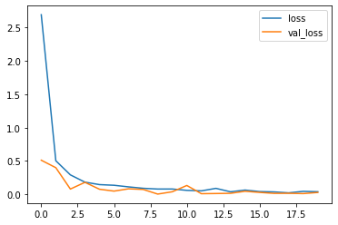

# Fruit Classification

Fruit Classification Model that demonstrate how to perform fruit classification. The model is trained to classify different types of fruits from images.

## Note

I ran the code on Google Colab and forgot to create the `requirements.txt` file. Please install the necessary dependencies manually.


## Dataset

The dataset used for training and testing is the [Fruits-360 dataset](https://www.kaggle.com/datasets/moltean/fruits), which contains images of various fruits.

### Dataset properties

- The total number of images: 90483.

- Training set size: 67692 images (one object per image).

- Test set size: 22688 images (one object per image).

- The number of classes: 131 (fruits and vegetables).

- Image size: 100x100 pixels.


## Model Structure

used vgg16 model structure and we added the last 2 layers to it in order to get the advantage of vgg16 feature extraction.

```Our Model
Model: "model"
_________________________________________________________________
 Layer (type)                Output Shape              Param #   
=================================================================
 input_1 (InputLayer)        [(None, 100, 100, 3)]     0         
                                                                 
 block1_conv1 (Conv2D)       (None, 100, 100, 64)      1792      
                                                                 
 block1_conv2 (Conv2D)       (None, 100, 100, 64)      36928     
                                                                 
 block1_pool (MaxPooling2D)  (None, 50, 50, 64)        0         
                                                                 
 block2_conv1 (Conv2D)       (None, 50, 50, 128)       73856     
                                                                 
 block2_conv2 (Conv2D)       (None, 50, 50, 128)       147584    
                                                                 
 block2_pool (MaxPooling2D)  (None, 25, 25, 128)       0         
                                                                 
 block3_conv1 (Conv2D)       (None, 25, 25, 256)       295168    
                                                                 
 block3_conv2 (Conv2D)       (None, 25, 25, 256)       590080    
                                                                 
 block3_conv3 (Conv2D)       (None, 25, 25, 256)       590080    
                                                                 
 block3_pool (MaxPooling2D)  (None, 12, 12, 256)       0         
                                                                 
 block4_conv1 (Conv2D)       (None, 12, 12, 512)       1180160   
                                                                 
 block4_conv2 (Conv2D)       (None, 12, 12, 512)       2359808   
                                                                 
 block4_conv3 (Conv2D)       (None, 12, 12, 512)       2359808   
                                                                 
 block4_pool (MaxPooling2D)  (None, 6, 6, 512)         0         
                                                                 
 block5_conv1 (Conv2D)       (None, 6, 6, 512)         2359808   
                                                                 
 block5_conv2 (Conv2D)       (None, 6, 6, 512)         2359808   
                                                                 
 block5_conv3 (Conv2D)       (None, 6, 6, 512)         2359808   
                                                                 
 block5_pool (MaxPooling2D)  (None, 3, 3, 512)         0         
                                                                 
 flatten (Flatten)           (None, 4608)              0         
                                                                 
 dense (Dense)               (None, 24)                110616
```

## Result

the experiment was done on [google colab](https://colab.research.google.com).

### training 

- Epochs: 20

- Training Loss: 3%, Validation Loss: 2%.

- Training Accuracy: 99%, Validation Accuracy: 99%




## Prerequisites

- Python 3.x

- Required libraries: numpy, keras, tensorflow, scipy, matplotlib

## Contributing

Contributions are welcome! Feel free to open issues or submit pull requests or for any improvement.

## Contact

For any inquiries or support, please contact [Adnan AlKharfan](https://github.com/adnanAlKharfan).


